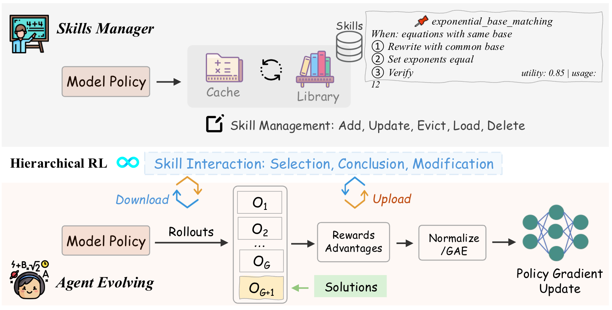

  <h1 align="center">
  ARISE: Agent Reasoning with Intrinsic Skill Evolution in Hierarchical Reinforcement Learning 
  
  </h1>
  

    <!-- Authors -->
    <!-- <strong>Author Name</strong>1 -->
     
    <!-- Affiliations -->
    <!-- 1Institution -->
     
    <!-- &nbsp; -->
    &nbsp;
     
    
  

   

Due to a server outage, we will do our best to release the code by the end of March, 2026.
